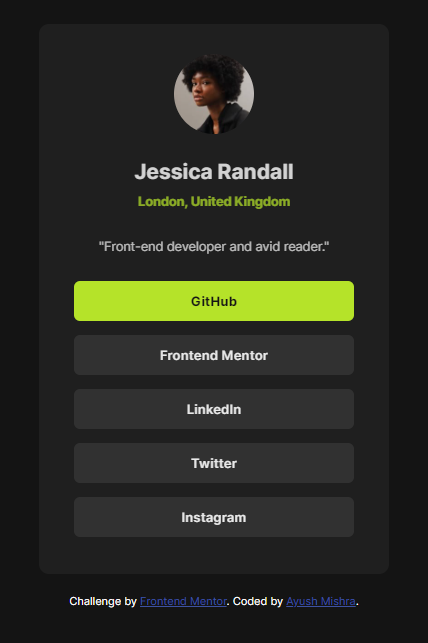

# Frontend Mentor - Social links profile solution

This is a solution to the [Social links profile challenge on Frontend Mentor](https://www.frontendmentor.io/challenges/social-links-profile-UG32l9m6dQ). Frontend Mentor challenges help you improve your coding skills by building realistic projects. 

## Table of contents

- [Overview](#overview)
  - [The challenge](#the-challenge)
  - [Screenshot](#screenshot)
  - [Links](#links)
- [My process](#my-process)
  - [Built with](#built-with)
  - [What I learned](#what-i-learned)
  - [Useful resources](#useful-resources)
- [Author](#author)
- [Acknowledgments](#acknowledgments)

## Overview

### The challenge

Users should be able to:

- See hover and focus states for all interactive elements on the page

### Screenshot


### Links

- Solution URL: [Solution on Github](https://github.com/ayushnvs/social-links-profile-main)
- Live Site URL: [Live on GH Pages](https://ayushnvs.github.io/social-links-profile-main/)

## My process

### Built with

- Semantic HTML5 markup
- CSS custom properties
- Flexbox
- [Google Fonts](https://fonts.google.com/) - For styles

### What I learned

```html
<h1>Practice makes a man perfect.</h1>
```
```css
.learning-quote {
  font-family: "Practice makes a man perfect.";
}
```
```js
const learningLog = () => {
  console.log('🎉Practice makes a man perfect🎉')
}
```

### Useful resources

- [FCC YT tutorial](https://www.youtube.com/watch?v=zJSY8tbf_ys) - Gone through the CSS part of this tutorial assuming the fact this is first time trying frontend development.

## Author

- Website - [Ayush Mishra]() (Still working on my site)
- Frontend Mentor - [@ayushnvs](https://www.frontendmentor.io/profile/ayushnvs)

## Acknowledgments

I would like to thank FreeCodeCamp and [Zach](https://github.com/zachgoll) for providing an amzing tutorial on CSS and frontendend development.
